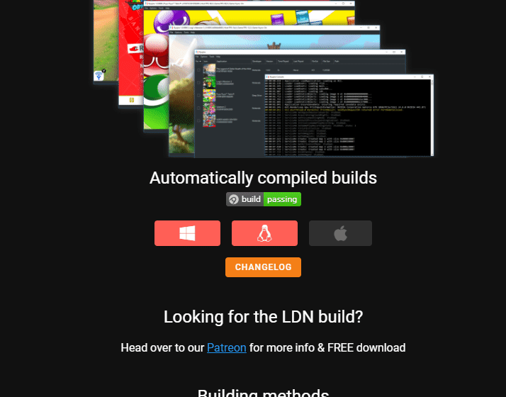
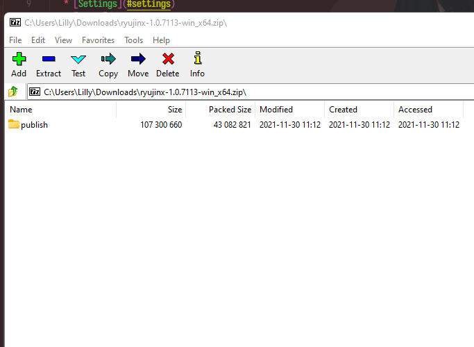
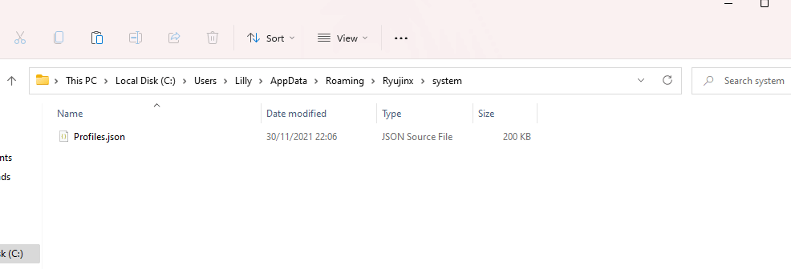
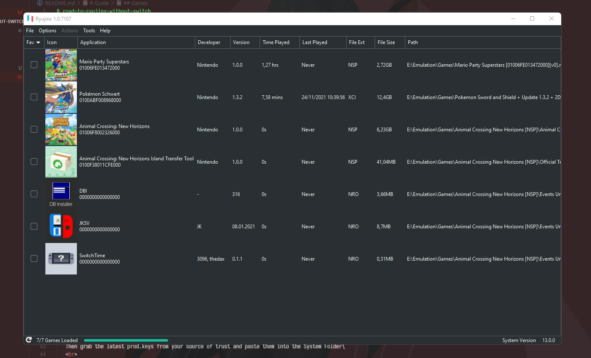
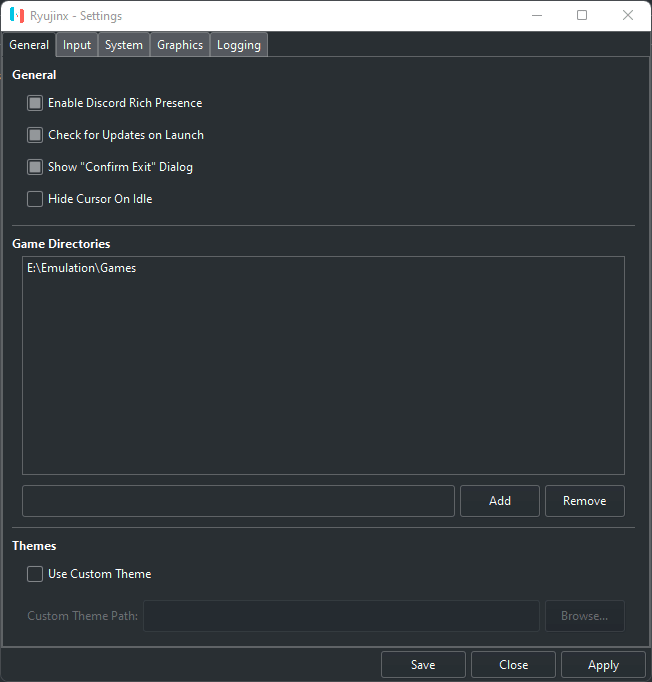

# road-to-ryujinx-without-switch

# WE ARE BACK https://github.com/GreemDev/Ryujinx

My continuation of this from *bleh-zu* but WITHOUT any Piracy. Really.
No Hidden Shit. If you use this as reference feel free to link this somwhere or in a pinned commend or smth.
Basically the only Switch Emulator Guide you need

   * [Introduction](#introduction)
   * [Guide](#guide)
   * [Manual](#manual-setup)
      * [ryujinx&nbsp;Setup](#setup)
      * [Mods/Patches](#mods)
   * [Settings](#settings)
   * [Games](#games)
   * [Mentions](#mentions)
   * [Goodbye](#goodbye)

   # Introduction

   Sup people,
   after many years (2. Im fucking old now send help.) i decided to make this Guide for Ryujinx too.\
   Had this Idea sitting in my head for some time now, so i thought why not just do it now.\
   Most will look copied and im recording this while im writing this for the ASMR Keyboard People here. (Or if your generally interested on how i work on this lol)\
   This from the Code basis may look like the [Switch Repo](https://github.com/PrincessAkira/road-to-yuzu-without-switch), which indeed it is. Why re-invent the wheel?

   # Guide
   
   ## Manual-Setup

   ### Setup

   Go to the [Rujinx Site](https://ryujinx.org/download) and Download the Build.\
    
   

   Then open the file you downloaded in a Program like 7Zip or Winrar and extract it to a folder of your choice.\
    
   
   
   Open your Ryujinx and Navigate to `File -> Open Ryujinx Folder`\
   Then grab the latest prod.keys from your [source of trust](https://rentry.org/128bbkeys) and paste them into the System Folder\
    
   

   The next step is to install a Firmware that can be found on [darthsternie](https://darthsternie.net/switch-firmwares/)\
   Download the Firmware you want and then navigate to Ryujinx's `Tools -> Install Firmware -> Select Downloaded ZIP` 

   ## Mods

   To install Mods just get some Mods from [Yuzu Website (Bleh)](https://yuzu-emu.org/wiki/switch-mods/) or from [GBATemp](https://gbatemp.net/forums/nintendo-switch.283/).\
   Open the ZIP and extract it with the same hierarchy like me here.\
    
   

   ## Settings

   Heres the settings i use\
    
   

   ## Games

   I found a very good guide that can be found [here](https://rentry.co/SwitchHackingIsEasy/).
   Sorry, I just don't have a Homebrewed Switch to try it atm.
   When you have the XCI, load the Game via `Settings -> Game Directories`.
   If you are interested to get games, because i cant stop you from pirating, atleast get them from [nsw2u](https://nsw2u.net/)

   ### Mentions

   Myself because im so fucking cute. lol

   ### Goodbye

   Here the Video of me making this will be posted when im done uploading it. Enjoy some Keyboard ASMR soon lol
